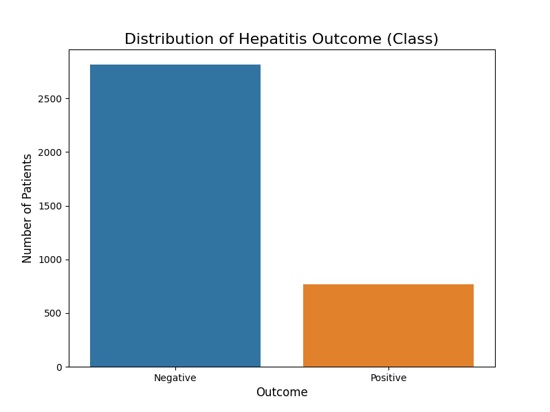
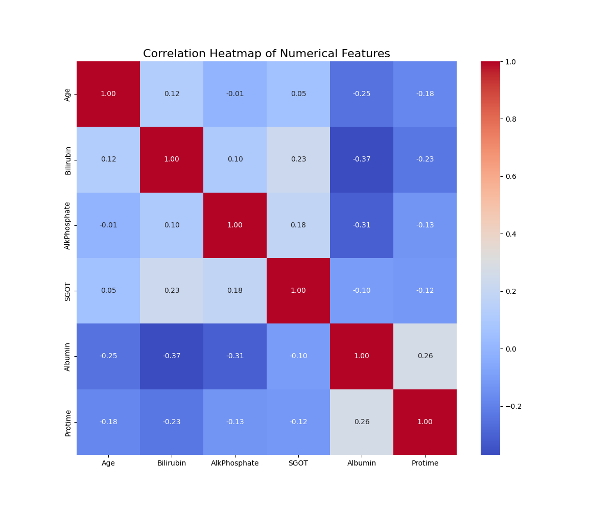

# Hepatitis B Prediction

This repository contains resources for building, analyzing, and deploying a machine learning model that predicts Hepatitis B infection risk based on patient data. The project includes data exploration, preprocessing, model training, evaluation, and a convenient web application for real-time predictions.

## Table of Contents

- [Project Overview](#project-overview)
- [Features](#features)
- [Repository Structure](#repository-structure)
- [Getting Started](#getting-started)
- [Usage](#usage)
- [Model Details](#model-details)
- [Results & Visualizations](#results--visualizations)
- [Requirements](#requirements)
- [Contributing](#contributing)
- [License](#license)

---

## Project Overview

Early and accurate prediction of Hepatitis B infection is crucial for timely intervention and improved patient outcomes. This project leverages real-world patient data, exploratory data analysis, and several machine learning algorithms to build an effective prediction model. The trained model can be used for automated prediction via a web app interface.

## Features

- Cleaned and preprocessed Hepatitis B patient data
- Exploratory data analysis and visualizations
- Training and evaluation of multiple machine learning models
- Comparison of model performance
- Deployment-ready prediction web application (Flask-based)
- Ready-to-use trained model (`joblib` format)

---

## Repository Structure

| File/Folder                      | Description                                                                                  |
|----------------------------------|----------------------------------------------------------------------------------------------|
| `app.py`                         | Streamlit web application for Hepatitis B prediction using the trained model.                    |
| `hepatitis 1.ipynb`              | Main Jupyter Notebook: data exploration, preprocessing, model training, and evaluation.      |
| `patients_data.csv`              | Dataset containing anonymized patient records and features relevant to Hepatitis B.           |
| `model_comparison_results.csv`   | Results comparing various ML models' performance.                                            |
| `hepatitis_prediction_model.joblib` | Serialized (joblib) file of the final trained machine learning model.                    |
| `class_distribution.png`         | Visualization of target class distribution in the dataset.                                   |
| `correlation_heatmap.png`        | Correlation heatmap showing relationships among features.                                    |
| `requirements.txt`               | Python package dependencies for running notebooks and the web app.                           |

---

## Getting Started

### Prerequisites

- Python 3.7+
- pip (Python package manager)

### Installation

1. **Clone the repository:**
   ```bash
   git clone https://github.com/aiyenigbacharles/Hepatitis-B-Prediction.git
   cd Hepatitis-B-Prediction
   ```

2. **Install dependencies:**
   ```bash
   pip install -r requirements.txt
   ```

3. **Explore the analysis:**
   Open `hepatitis 1.ipynb` in Jupyter Notebook or JupyterLab to review the data analysis and model training steps.

---

## Usage

### 1. Running the Web Application

The web application allows you to input patient features and receive a Hepatitis B risk prediction.

```bash
python app.py
```

Then, open your browser and go to `http://127.0.0.1:5000` to use the interface.

### 2. Running the Notebook

Use the Jupyter notebook for detailed data exploration, feature engineering, and model evaluation:

```bash
jupyter notebook hepatitis\ 1.ipynb
```

---

## Model Details

- **Data:** Patient data including demographic and clinical features.
- **Process:** Data cleaning, EDA, feature selection, model training (multiple algorithms), evaluation, and selection of the best model.
- **Best Model:** See `model_comparison_results.csv` for detailed metrics.
- **Serialization:** The best model is saved as `hepatitis_prediction_model.joblib` for deployment.

---

## Results & Visualizations

- **Class Distribution:** 
- **Feature Correlation:** 
- **Model Comparison:** See `model_comparison_results.csv` for accuracy, precision, recall, and F1-score of different algorithms.

---

## Requirements

All required Python libraries are listed in `requirements.txt`. Key dependencies may include:

- pandas
- numpy
- scikit-learn
- matplotlib
- seaborn
- Flask
- joblib

Install with:

```bash
pip install -r requirements.txt
```

---

## Contributing

Contributions are welcome! Please fork the repository and submit a pull request.

---

## License

This project is provided for educational and research purposes. Please check the repository or contact the author for specific licensing information.

---

## Author

- **aiyenigbacharles**  
  [GitHub Profile](https://github.com/aiyenigbacharles)
